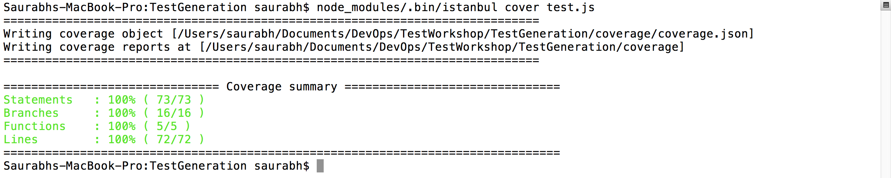
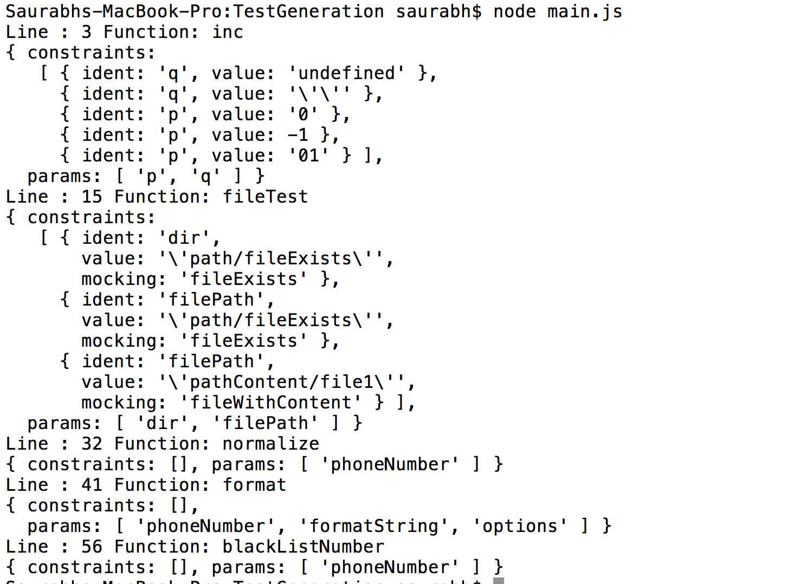

# Dev-Ops CSC 791 Homework 2 Submission

## Student Name: Saurabh Joshi
## Unity ID    : sjoshi6

### 1. Coverage Report

### 2. Main.js execution

### 3. Link to Detailed Coverage Report
[here](https://github.com/sjoshi6/DevOps-HW2/blob/master/coverage/lcov-report/TestGeneration/index.html)
